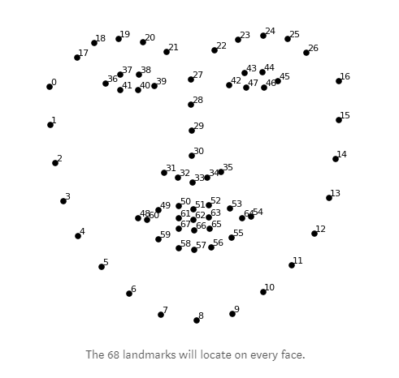

## EmotionRecognitionDemo-Android

轻量表情识别演示程序

### 算法实现

1. 利用 dlib 计算人脸68个关键点

   

2. 除去无用关键点[$^{[3]}$](papers/Emotion-identification-by-facial-landmarks-dynamics-analysis.pdf)，增加关键点关系对[$^{[4]}$](papers/Exploiting_Facial_Landmarks_for_Emotion_Recognition_in_the_Wild.pdf)，得出用于表情分类的特征值

3. 利用 OpenCV 的 SVM 进行分类

### 数据集

1. CK+，5 emotions (angry, happy, sad, neutral, surprised)

### 软件使用说明

1. 先将 shape_predictor_68_face_landmarks.dat 文件复制到手机存储根目录
2. 只能单方向横屏识别

### 文件说明

- emotion_landmark.py       模型训练代码
- testModel.py       模型测试代码
- CK+.tar.gz     分类好的表情图片
- shape_predictor_68_face_landmarks.dat     关键的检测模型

### Reference

1. [Emotion Detection from Facial Expression using SVM](papers/Emotion_Detection_from_Facial_Expression_using_SVM.pdf)
2. [Emotion detection in real-time on an Android Smartphone](papers/Emotion_detection_in_real-time_on_an_Android_Smartphone.pdf)
3. [Emotion identification by facial landmarks dynamics analysis](papers/Emotion-identification-by-facial-landmarks-dynamics-analysis.pdf)
4. [Exploiting Facial Landmarks for Emotion Recognition in the Wild](papers/Exploiting_Facial_Landmarks_for_Emotion_Recognition_in_the_Wild.pdf)

